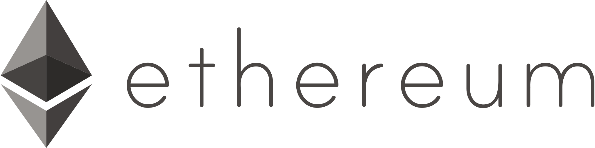
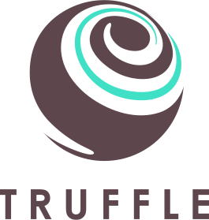
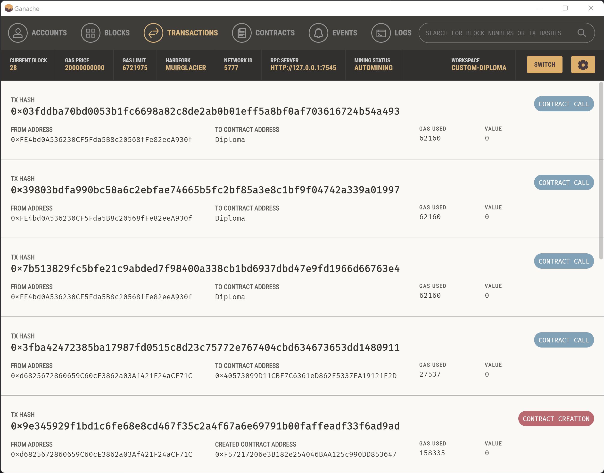

# Local Ethereum blockchain to store document hashes

Setting up and using a local **Ethereum blockchain** to store document hashes.


---

# Table of Contents

* [About the project](#about-the-project)
* [Getting Started](#getting-started)
  * [Prerequisites](#prerequisites)
  * [Project setup](#project-setup)
  * [Installation](#installation)
* [License](#license)

# About the project

<table>
  <tr>
    <td>
        
    </td>
    <td>
        
    </td>
    <td>
        
    </td>
    <td>
        
    </td>
    <td>
        
    </td>
  </tr>
</table>

This is a sample project for storing and reading document hashes from / to the **Ethereum blockchain**.

> [!IMPORTANT]
> This project is for **testing purpose only**.
> 
> The **smart contract** is **not** intended to be deployed on the Ethereum main network.

You may also take a look at the [eth-hash-app](https://github.com/Yann39/eth-hash-app) project to interact with the blockchain using Java.

# Getting started

## Prerequisites

You will need the following tools to create / run the project :
- NodeJS & NPM
- Truffle
- Ganache
- Solidity plugin for Intellij (nice to have)

To install Truffle : `npm install -g truffle`

## Project setup

### Command line

- Create new empty Intellij project (i.e. _eth-hash-chain_)
- Navigate to the project directory : `cd C:\Git\eth-hash-chain`
- Initialize **Truffle** project (this creates various directories and files) : `truffle init`
- Create a new **Solidity** file (_Diploma.sol_) in the _contracts_ directory, which will hold our smart contract : `truffle create contract Diploma`
  
  Minimal contract code :  
  ```solidity
  pragma solidity ^0.8.0;
  
  contract Diploma {
      struct Record {
          uint mineTime;
          uint blockNumber;
      }
  
      mapping(bytes32 => Record) private docHashes;
  
      constructor() { }
  
      function addDocHash(bytes32 hash) public {
          Record memory newRecord = Record(block.timestamp, block.number);
          docHashes[hash] = newRecord;
      }
  
      function findDocHash(bytes32 hash) public view returns (uint, uint) {
          return (docHashes[hash].mineTime, docHashes[hash].blockNumber);
      }
  }
  ```
- Compile the code : `truffle compile`
- Create a **migration** file : `truffle create migration Diploma`
- Edit the generated **JavaScript** file _xxx_diploma.js_ to tells Truffle to obtain a reference to the `Diploma` contract and deploy it :
  ```javascript
  var DiplomaContract = artifacts.require("Diploma");
  module.exports = function(deployer) {
      deployer.deploy(DiplomaContract);
  };
  ```
- Start **Ganache**, create a workspace and link the Truffle project by selecting the _truffle-config.js_ file
- Edit the _truffle-config.js_ file which is the main configuration file, to configure the network to connect to the development blockchain (provided by Ganache) :
  ```javascript
  development: {
      host: "localhost",
      port: 7545,
      network_id: "*"
  }
  ```
- Deploy the contract onto the test blockchain : `truffle migrate --network development`
- To redeploy, simply add the `--reset` option : `truffle migrate --network development --reset`
- Connect to truffle console (uses the **web3js** library) : `truffle console`
- We can now interact with the contract using javascript console (I have first generated a SHA256 hash from a file) :
  ```javascript
  Diploma.address
  diploma = await Diploma.deployed();
  diploma.addDocHash("0x816bf8b135fb51711d0622a2ae156b6b4505d9ba83ae243ff1fb26d8300d9bdf");
  diploma.findDocHash("0x816bf8b135fb51711d0622a2ae156b6b4505d9ba83ae243ff1fb26d8300d9bdf");
  ```
- Write tests (it uses **Mocha**/**Chai**) by creating a _diploma.js_ file under the _test_ directory :
  ```javascript
  const Diploma = artifacts.require("Diploma");
  contract("Diploma test", async accounts => {
    it("check that the balance increase", async () => {
      // test here
    });
  });
  ```
- run tests : `truffle test ./test/diploma.js`

You can at any moment explore the blockchain via Ganache UI :



### Java

To interact with the blockchain via Java :

- Add Java Ethereum **Web3j** dependency :
  ```xml
  <dependency>
    <groupId>org.web3j</groupId>
    <artifactId>core</artifactId>
    <version>5.0.0</version>
  </dependency>
  ```
- Either :
  - interact with the deployed contract using raw methods
  - use **Web3j command line tools** or **Web3j Maven plugin** (requires **solc** compiler) to generate a
    contract wrapper (Java class) that can be used to interact with the contract

See [eth-hash-app](https://github.com/Yann39/eth-hash-app) project for more details.

## Installation

1. Clone the repository :
    ```shell script
    git clone https://github.com/Yann39/eth-hash-chain
    ```
2. Navigate to the _contracts_ directory from your CLI
3. Compile the smart contract using **Truffle** :
    ```shell script
    truffle compile
    ```
4. Deploy the contract onto the test blockchain :
    ```shell script
    truffle create migration Diploma
    ```

# License

[General Public License (GPL) v3](https://www.gnu.org/licenses/gpl-3.0.en.html)

This program is free software: you can redistribute it and/or modify it under the terms of the GNU
General Public License as published by the Free Software Foundation, either version 3 of the
License, or (at your option) any later version.

This program is distributed in the hope that it will be useful, but WITHOUT ANY WARRANTY; without
even the implied warranty of MERCHANTABILITY or FITNESS FOR A PARTICULAR PURPOSE. See the GNU
General Public License for more details.

You should have received a copy of the GNU General Public License along with this program. If not,
see <http://www.gnu.org/licenses/>.